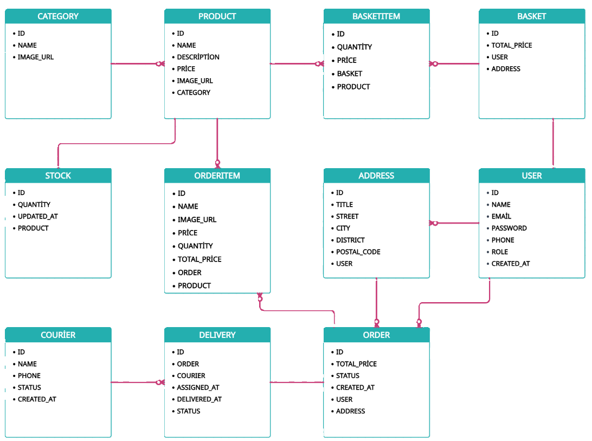

# E-Commerce REST API

#### Bu proje, temel bir e-ticaret platformunun backend işlevlerini sağlayan bir Spring Boot REST API uygulamasıdır. Proje, kategoriler, ürünler, sepet işlemleri, sipariş yönetimi ve kargo takibi gibi temel e-ticaret işlevlerini içermektedir.
#### NOT: Proje henüz tamamlanmamıştır. Devam eden geliştirmeler ve iyileştirmeler yapılacaktır.

